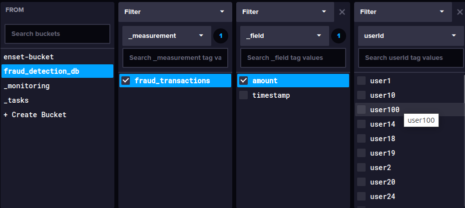

# Application Java de Détection de Fraude en Temps Réel avec Kafka Streams, InfluxDB et Grafana

Ce projet implémente un système de détection de fraudes en temps réel utilisant Kafka Streams, InfluxDB et Grafana. Le système analyse les transactions financières en continu et détecte les transactions suspectes basées sur des règles prédéfinies.

## Architecture du Système
1. **Kafka & Kafka Streams**:
    - Topic transactions-input : Reçoit les transactions brutes
    - Topic fraud-alerts : Stocke les transactions détectées comme suspectes
    - Application Kafka Streams : Traite les transactions en temps réel

2. **InfluxDB Stockage en Temps Réel**:
    - Les transactions suspectes sont stockées dans une base de données **InfluxDB** pour un suivi en temps réel.

3. **Grafana Tableau de Bord Interactif**:
    - Grafana est utilisé pour afficher les données en temps réel avec des métriques telles que :
        - Nombre total de transactions suspectes.
        - Montant total des transactions.
        - Transactions suspectes au fil du temps.

    

## Implémentation
### 1. Topics crées

### 2. TransactionProducer

### 2. FraudDetectionApp

### 3. Configuration des Topics Kafka
- Configurer Kafka avec deux topics :
    - **`transactions-input`** : Contient les transactions brutes.
    - **`transaction consusmer`** : Consome les messages provonant du producer de transactions-input
    - **`fraud-alerts`** : Stocke les transactions suspectes.
    - **`fraud consusmer`** : Consome les messages provonant du producer fraud-alerts

### 4. Stocker les Transactions Suspectes dans InfluxDB
- Insertion des transactions suspectes directement dans InfluxDB avec des champs tels que :
    - `userId`
    - `amount`
    - `timestamp`

### 4. Tableau de Bord Grafana
- Configuration de Grafana pour se connecter à InfluxDB et visualiser les transactions suspectes.

## Aperçu de l’Architecture
1. **Kafka Streams** : Traite les données de transaction entrantes et applique les règles de détection de fraude.
2. **InfluxDB** : Stocke les transactions suspectes pour analyse et visualisation.
3. **Grafana** : Fournit un tableau de bord interactif et en temps réel pour le suivi.

